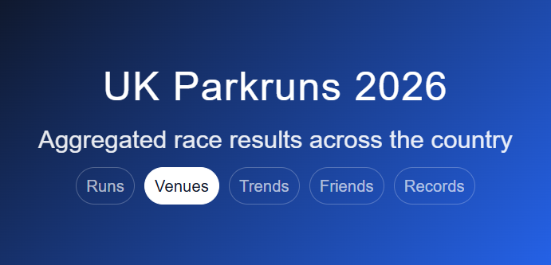

a Rails app for exploring Parkrun data

[Parksurf](https://parksurf.co.uk/)  
<br>

[](https://github.com/rubocop/rubocop)

[](https://rubystyle.guide)


### Inital Steps

```
$ rails new parkrun-pro -d=postgresql -c=bootstrap  
$ cd parkrun-pro  
$ touch .yarnrc.yml  
(add nodeLinker: node-modules to .yarnrc.yml)  
(Delete the pnp files)  
$ yarn install (node_modules appears)  
$ bundle  
$ rails db:migrate  
$ bin/dev

$ bin/rails generate authentication
$ bin/rails db:migrate

$ rails c
User.create! email_address: "dan@gmail.com", password: "foobar", password_confirmation: "foobar"

$ mkdir app/views/users
$ touch app/views/users/index.html

$ rails g model Run name:index gender:index agegroup:index time:integer:index
```